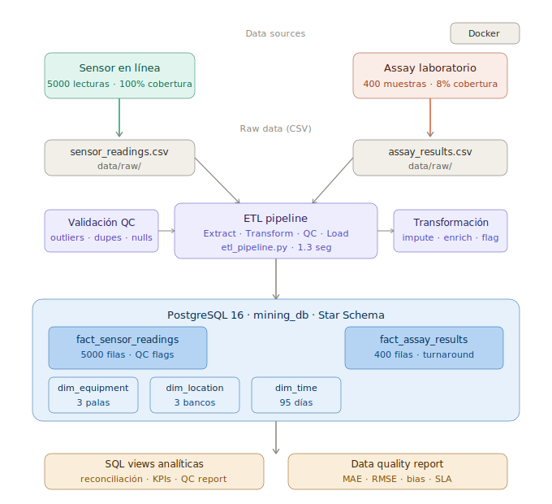

# Mining Grade Control — Data Pipeline

Pipeline de ingeniería de datos para control de ley mineral (grade control)
en operaciones mineras de cobre. Simula el flujo real de datos entre sensores
en línea (sensor-based sorting) y resultados de laboratorio (assay), con
detección automática de problemas de calidad y reconciliación estadística.

---

## Contexto del Dominio

En minería, dos sistemas miden la ley (concentración de mineral) del mismo
material con distintas características:

| Sistema | Velocidad | Precisión | Cobertura |
|---|---|---|---|
| Sensor en línea (XRF/ShovelSense) | Tiempo real | ±8% error | 100% de cargas |
| Assay de laboratorio | 2-5 días | ±2% error | ~8% de cargas |

El pipeline reconcilia ambas fuentes para detectar sensores descalibrados,
calcular KPIs de precisión (MAE, RMSE, bias) y monitorear SLAs del laboratorio.

---

## Arquitectura

data/raw/                        PostgreSQL (mining_db)
├── sensor_readings.csv  ──ETL──► fact_sensor_readings
└── assay_results.csv    ──ETL──► fact_assay_results
dim_equipment
dim_location
dim_time
│
SQL Views
├── v_sensor_assay_reconciliation
├── v_equipment_kpis
├── v_monthly_grade_trend
└── v_data_quality_report
│
data_quality_checks.py
(reporte automático diario)
---

## Stack Tecnológico

- **Python 3.12** — generación de datos, ETL, QC
- **PostgreSQL 16** — almacenamiento, modelo dimensional (Star Schema)
- **pandas / numpy** — transformación y análisis
- **SQLAlchemy** — ORM y conexión a base de datos
- **python-dotenv** — gestión segura de credenciales

---

## Estructura del Proyecto
mining-data-pipeline/
├── data/
│   ├── raw/                  # Datos crudos generados (CSV)
│   └── processed/            # Datos limpios post-ETL
├── sql/
│   ├── schema.sql            # Modelo dimensional (Star Schema)
│   └── views_qc.sql          # Vistas analíticas y reconciliación
├── src/
│   ├── generate_synthetic_data.py   # Generador de datos sintéticos
│   ├── etl_pipeline.py              # Pipeline ETL principal
│   └── data_quality_checks.py       # Reporte automático de QC
├── .env.example              # Template de variables de entorno
├── requirements.txt
└── README.md

---

## Instalación y Uso

### 1. Clonar y preparar entorno

```bash
git clone https://github.com/tu-usuario/mining-data-pipeline.git
cd mining-data-pipeline
python3 -m venv venv
source venv/bin/activate
pip install -r requirements.txt
```

### 2. Configurar base de datos

```bash
# Iniciar PostgreSQL
sudo service postgresql start

# Crear usuario y base de datos
sudo -u postgres psql -c "CREATE USER mining_user WITH PASSWORD 'mining_pass123';"
sudo -u postgres psql -c "CREATE DATABASE mining_db OWNER mining_user;"

# Crear schema
psql -h localhost -U mining_user -d mining_db -f sql/schema.sql
psql -h localhost -U mining_user -d mining_db -f sql/views_qc.sql
```

### 3. Configurar credenciales

```bash
cp .env.example .env
# Editar .env con tus credenciales
```

### 4. Ejecutar pipeline completo

```bash
# Generar datos sintéticos
python src/generate_synthetic_data.py

# Ejecutar ETL
python src/etl_pipeline.py

# Generar reporte de calidad
python src/data_quality_checks.py
```

---

## Resultados del Pipeline

### KPIs de Precisión de Sensores

| Equipo | MAE | RMSE | Bias | Estado |
|---|---|---|---|---|
| SHOVEL-01 | 0.0686 | 0.0836 | +0.0125 | ✅ OK |
| SHOVEL-02 | 0.0655 | 0.0802 | -0.0056 | ✅ OK |
| SHOVEL-03 | 0.0713 | 0.0849 | -0.0131 | ✅ OK |

### Calidad de Datos

| Métrica | Valor |
|---|---|
| Total lecturas sensor | 5,000 |
| Total assays | 400 |
| QC Pass Rate | 99.50% |
| Cobertura assay | 8.0% |
| Turnaround laboratorio | 3.5 días promedio |
| SLA violaciones | 0 |

---

## Conceptos de Ingeniería de Datos Aplicados

- **Star Schema** — modelo dimensional con tablas FACT y DIM
- **ETL idempotente** — `INSERT ... ON CONFLICT DO NOTHING` permite re-ejecución segura
- **Data Quality checks** — detección automática de outliers (3-sigma), duplicados y nulos
- **Vistas SQL analíticas** — abstracción entre el pipeline y el consumidor de datos
- **Gestión de credenciales** — variables de entorno via `.env`, nunca hardcodeadas
- **Reconciliación estadística** — MAE, RMSE, bias para validación de sensores

---

## Próximos Pasos (roadmap)

- [ ] Orquestación con Apache Airflow (DAG diario)
- [ ] Particionamiento de tablas por fecha (performance a escala)
- [ ] Dashboard en Metabase o Grafana
- [ ] Containerización con Docker
- [ ] CI/CD con GitHub Actions


